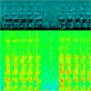
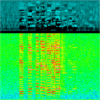
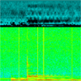
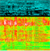
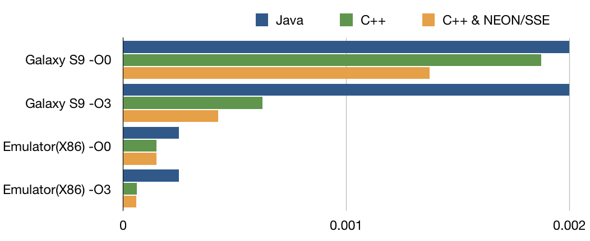

# Real-time 26-Point MFCC & 512-Point Radix-2 FFT Generator & Visualizer on Android in Java, C++ and NEON Intrinsics

# Performance Figures
The following table and figure shows the average time in seconds observed for MFCC generation per 400-sample frame.

* Java : All written in Java code
 
* C++ : All written in Native C++ with JNI interface.

* C++ & NEON/SSE : Written in C++ with 4-lane NEON/SSE SIMD intrinsics for Hamming, FFT, and DCT.

Conditions

* Galaxy S9 -O0 : Galaxy S9 with 8-Core Snapdragon 845 with C++ compiler optimization level 0

* Galaxy S9 -O3 : Galaxy S9 with 8-Core Snapdragon 845 with C++ compiler optimization level 3

* Emulator (X86) -O0 : Android Emulator on a Host PC with 4-Core emulation with C++ compiler optimization level 0 

* Emulator (X86) -O3 : Android Emulator on a Host PC with 4-Core emulation with C++ compiler optimization level 3

The numbers are all in seconds.

| Tables            | Java          |      C++      | C++ NEON SSE  |
| ----------------- |---------------|---------------|---------------|
| Galaxy S9 -O0     |   0.0016      |    0.0015     |    0.0011     |
| Galaxy S9 -O3     |   0.0016      |    0.00050    |    0.00034    |
| Emulator(X86) -O0 |   0.00020     |    0.00012    |    0.00012    |
| Emulator(X86) -O3 |   0.00020     |    0.000049   |    0.000047   |

# Install
Download the contents and open with AndroidStdio, then make.
It was tested with the following environment.

* Android Studio 3.5.1

* Min SDK Version 21

* Virtual device API29, Android 10.0, x86

If it does not work, check the App permission for Mic on the device.
Also, try chanding RECORDING_RATE in AudioReceiver.

# Description
Originally motivated to measure the real-time performance of audio signal processing on Android devices.
This is a study implementation as a bench-mark for a Native C++ implematation with Neon SIMD intrinsics.

* Audio input 16KHz monaural linear PCM taken from AudioRecorder

* Frame size 400 samples (25[ms]), Frame shift 160 samples (10[ms])

* Pre-emphasis (tap 0.96)

* Hamming window per frame

* 512-Point Radix-2 Cooley-Tukey recursive FFT

* Mel Filterbank, 26 banks, top 8KHz, bottom 300Hz, with flooring at 1.0

* DCT into 26-point MFCC [quefrency] with DC.

# Spectrum Visualization for Fun
The upper part is the 26-point MFCC. The lower part is the 256-point spectrum taken from 512-point FFT.
Plese click the thumbnails to enlarge.

* 
[ 440Hz Sine ](doc/440Hz.png) : 440 Hz Sine wave with some background noise.

* 
[ 'Android audio' ](doc/AndroidAudio.png) : Me saying "Android audio".

* 
[ 'Blah Blah Blah' ](doc/BlahBlahBlah.png ) : Me saying "Blah Blah Blah...".

* 
[ 'Wir sind alle programmiert.' ](doc/WirSindAlleProgrammiertTimBendzko.png) : Me saying "Wir sind alle programmiert."

* 
[ Piano Single Tones ](doc/GrandPianoSingleTonesC3andC4.png) : Grand Piano Single Tones C3 and then C4.

* 
[ Piano Chord ](doc/GrandPianoCMaj9.png) : Grand Piano Chord C maj9

* 
[ Synth Lead Melody ](doc/SynthLeadSpainBEGGbDBE.png) : Sythe lead tracing a line of Spain by Chick Corea (B->E->G->Gb->D->B->E).

* 
[ Cory Wong Jamming ](doc/CoryWongSlowlyJamming.png) : Cory Wong slowly jamming with his guitar. (https://youtu.be/i14pnaRzflU?t=208)

* 
[ Cory Henry & Nick Semrad @NAMM ](doc/CoryHenryNickSemrad.png) : Cory Henry and Nick Semrad playing Gospel at NAMM show. (https://www.youtube.com/watch?v=8TwhLplrFNo)

* 
[ Jaco Portrait of Tracy ](doc/JacoPortraitOfTracy.png) : Tried to capture the incredible harmonics of Portrait of Tracy, but not much seen. (https://www.youtube.com/watch?v=nsZ_1mPOuyk)

* 
[ Naturally 7 Human Voices ](doc/Naturally7.png) : Successfully captured the incredible grooves/vibrato of their voices. (https://www.youtube.com/watch?v=AF-KagTq7qY)

* 
[ Vulfpeck ](doc/TheoKatzmanHalfTheWay.png) : Theo Katzman's singing voice. (https://www.youtube.com/watch?v=6HUkbf44iAA)

* 
[ Tori Kelly ](doc/ToriKelly.png) : Tori Kelly's incredible voice visualized. (https://www.youtube.com/watch?v=Jv8IqJm6q7w)

# Code

Core

* [HammingWindowJava](app/src/main/java/com/example/android_mfcc/HammingWindowJava.java): Pre-emphasis & Hamming for a 400-sample frame
* [FFT512Java](app/src/main/java/com/example/android_mfcc/FFT512Java.java): 512-point Radix-2 Cooley-Tukey recursive FFT with pre-calculated Twiddle table
* [MelFilterBanksJava](app/src/main/java/com/example/android_mfcc/MelFilterBanksJava.java): Generates MelFilterBanks log energy coefficients with Bins and precalculated table.
* [DCTJava](app/src/main/java/com/example/android_mfcc/DCTJava.java): 26-point DCT with a pre-calculated table.

Visualization

* [ScrollingHeatMapView](app/src/main/java/com/example/android_mfcc/ScrollingHeatMapView.java): ImageView for real-time scrolling spectrum visuzliation.

Others

* [AudioReceiver](app/src/main/java/com/example/android_mfcc/AudioReceiver.java): receives audio with android.media.AudioRecorder in chunks in realtime.

* [AudioChunkAggregator](app/src/main/java/com/example/android_mfcc/AudioChunkAggregator.java): arranges the audio data into 400[ms] frames with 10[ms] frame shift.

# References

* J. S. Bridle and M. D. Brown (1974), "An Experimental Automatic Word-Recognition System", JSRU Report No. 1003, Joint Speech Research Unit, Ruislip, England.

* "Digital signal processing" by Proakis, Manolakis 4th edition Chap 8: Efficient Computation of the DFT: Fast Fourier Transform

* [Mel Frequency Cepstral Coefficient (MFCC) tutorial](http://practicalcryptography.com/miscellaneous/machine-learning/guide-mel-frequency-cepstral-coefficients-mfccs) : Nice tutorial.

* [libmfcc](https://github.com/rohithkd/libmfcc) : C-implementation.

* [MFCC.cpp](https://github.com/MTG/miredu/blob/master/src/MFCC.cpp) : another nice C-implemetation

# Contact

For technical and commercial inquiries, please contact: Shoichiro Yamanishi

yamanishi72@gmail.com